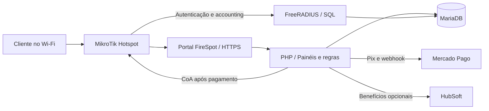

# FireSpot

**Gestão de Wi-Fi Hotspot com MikroTik, FreeRADIUS e monetização por Pix.**

O FireSpot reúne portal cativo, controle de acesso, estabelecimentos, equipamentos e operação financeira em uma aplicação PHP. Permite oferecer internet paga, cortesia, acesso patrocinado e benefícios para assinantes, com políticas próprias para cada ponto de acesso.

[Recursos](#recursos) · [Desenvolvimento local](docs/LOCAL_DEVELOPMENT.md) · [Instalação](#instalação-completa) · [FreeRADIUS](#configuração-do-freeradius) · [MikroTik](#mikrotik-e-primeiro-hotspot) · [Publicação](docs/DEPLOYMENT.md) · [Problemas comuns](#problemas-comuns)

## Recursos

| Área | O que o projeto oferece |
| --- | --- |
| **Portal cativo** | Portal V3 personalizável, identidade visual, cinco apresentações de portal, prévia, rascunhos e publicação versionada. Portais anteriores permanecem para compatibilidade. |
| **Internet paga** | Planos com duração e velocidade, Pix/Mercado Pago, acompanhamento do pagamento, webhook e reconciliação. Carteira central ou carteira própria do estabelecimento. |
| **Janela Pix** | Acesso temporário autenticado por RADIUS para abrir o aplicativo bancário. Após aprovação, promoção da sessão por CoA, com tentativas posteriores pelo servidor. |
| **Cortesia** | Duração, validade, consumo por tempo online ou corrido, limites por aparelho/conta, intervalo entre concessões e exceções por ponto. |
| **Acesso patrocinado** | Campanhas, imagens/vídeos, ações de interesse, acesso condicionado à jornada publicitária e registros de entrega. |
| **Rede publicitária** | Inventário, posicionamentos, políticas por estabelecimento/ponto, anúncios recompensados e receita agregada. O módulo contempla Google Ad Manager; começa desligado e em modo de teste. A produção exige configuração e validação próprias. |
| **Assinantes** | Área Minha Conta, integração HubSoft/FIRENETWORK, elegibilidade por plano/serviço, benefícios, dispositivos, simultaneidade e revalidação. Os gates de ativação começam fechados. |
| **Múltiplos estabelecimentos** | Administração central e painel do estabelecimento, equipe com permissões, planos da plataforma, assinaturas, cotas e capacidades por contrato. |
| **Múltiplos Hotspots** | Pontos individualizados, associação ao NAS/interface, VLAN/rede, políticas comerciais e configurações por estabelecimento. |
| **MikroTik/RouterOS** | Cadastro e inventário, sincronização por SSH, interfaces, preparação da base RADIUS/CoA e fluxo separado de aplicação de instalações. Verificações para RouterOS 6 e 7. |
| **AAA com FreeRADIUS** | Credenciais individuais, validade, tempo restante, velocidade, accounting, simultaneidade e integração com desconexão/CoA. |
| **Operação** | Dashboard, financeiro, recebimentos, relatórios, métricas por ponto, fila de infraestrutura, jobs com bloqueio contra execução simultânea e verificações de prontidão. |
| **Segurança e privacidade** | Permissões, CSRF, credenciais criptografadas, chaves fora do diretório público, auditoria e retenção. Verificação de segredos na publicação pelo GitHub Actions. |

Os recursos dependem da configuração do servidor, dos equipamentos, das integrações e das permissões contratadas. Clonar o projeto não ativa pagamentos, anúncios ou benefícios de assinantes automaticamente.

## Como funciona



O FireSpot decide o direito de acesso e grava a autorização. O FreeRADIUS autentica a credencial e entrega os atributos de sessão. O MikroTik aplica o acesso e envia o accounting. **Accounting e CoA fazem parte da janela Pix**, e precisam ser testados além do simples `Access-Accept`.

## Requisitos

Referência dos comandos: **Ubuntu Server 22.04 LTS, Apache 2.4, PHP 8.1, MariaDB 10.6 e FreeRADIUS 3.x**. PHP 8.1 é a versão usada nas verificações desta distribuição; versões mais recentes devem passar pela homologação da aplicação. Esta referência de compatibilidade não substitui a escolha de versões com suporte de segurança para a operação.

| Componente | Necessidade |
| --- | --- |
| PHP | CLI e integração com Apache; PDO MySQL, cURL, mbstring, GD, XML, ZIP, bcmath, OpenSSL, Sodium, SSH2 e POSIX. |
| MariaDB | Banco da aplicação e tabelas SQL do RADIUS. O guia usa um banco compartilhado e duas contas restritas. |
| FreeRADIUS | Servidor 3.x, driver MySQL e ferramentas `radclient`. |
| Servidor web | Apache com `rewrite`, `headers` e regras `.htaccess`. Nginx exige regras equivalentes escritas e conferidas separadamente. |
| Rede | Domínio público com DNS e HTTPS; caminho de gerenciamento/VPN para NAS e RADIUS. |
| MikroTik | RouterOS 6/7, Hotspot e SSH pela rede de gerenciamento. Homologue a versão exata do equipamento. |
| Integrações | Credenciais próprias do Mercado Pago; HubSoft e publicidade são opcionais. |

A árvore atual usa arquivos PHP diretamente e não inclui manifesto Composer ou etapa obrigatória de build Node.

## Desenvolvimento local no Linux

Com Git, Python 3 e Docker Engine/Compose instalados:

```bash
git clone https://github.com/guedessoftware/firespot.git
cd firespot
python3 dev/setup.py --port 8090
bash dev/local.sh up -d --build --wait --wait-timeout 240
bash dev/local.sh exec -T web php dev/bootstrap.php
```

Acesse **http://localhost:8090/dashboard/login.php**, usuário **`admin_local`**. Consulte a senha gerada com `cat dev/.local/admin-password`. A porta é configurável; 8080 não é usada. Banco e uploads são locais, e não há dados de produção nem integrações externas ativadas.

Veja o [guia local](docs/LOCAL_DEVELOPMENT.md) para configuração, troca de porta, testes e rotina Git. Para enviar mudanças ao servidor, siga o [guia de publicação](docs/DEPLOYMENT.md), com conferência dos arquivos, backup e rollback. Push no GitHub não faz deploy automático.

## Instalação completa

> Execute em **servidor novo e banco vazio**. Para instalação existente, use a seção de [atualização](#operação-atualizações-e-backup). O script histórico `installers/ubuntu/install.sh` não é o instalador desta versão: ainda pressupõe um `schema.sql` ausente e configurações antigas.

Substitua `hotspot.seu-dominio.example` pelo domínio real. Valores entre `<...>` são campos a preencher, **não são credenciais utilizáveis**. Nunca cole senhas ou tokens em commits, issues ou capturas públicas.

### 1. Instalar os pacotes

```bash
sudo apt update
sudo apt install -y \
  apache2 mariadb-server mariadb-client git curl openssl python3 ripgrep \
  php8.1 libapache2-mod-php8.1 php8.1-cli php8.1-mysql \
  php8.1-curl php8.1-mbstring php8.1-gd php8.1-xml \
  php8.1-zip php8.1-bcmath php-ssh2 \
  freeradius freeradius-mysql freeradius-utils \
  certbot python3-certbot-apache

sudo a2enmod rewrite headers ssl
sudo systemctl enable --now apache2 mariadb
php -v
php -m
```

Confirme `pdo_mysql`, `curl`, `mbstring`, `gd`, `openssl`, `sodium`, `ssh2` e `posix`. Configure sincronização de horário e o mesmo fuso no FireSpot e no RADIUS; o exemplo usa `America/Manaus`.

```bash
sudo timedatectl set-timezone America/Manaus
timedatectl status
```

### 2. Baixar e proteger o código

```bash
sudo git clone https://github.com/guedessoftware/firespot.git /var/www/firespot
sudo chown -R root:root /var/www/firespot
sudo find /var/www/firespot -type d -exec chmod 755 {} +
sudo find /var/www/firespot -type f -exec chmod 644 {} +

sudo install -d -o root -g www-data -m 750 /etc/firespot
sudo install -o root -g www-data -m 640 \
  /var/www/firespot/.env.example /etc/firespot/firespot.env

sudo install -d -o www-data -g www-data -m 750 \
  /var/www/firespot/portal-v3/uploads/content
sudo chown www-data:www-data \
  /var/www/firespot/portal-v3/uploads/branding \
  /var/www/firespot/assets/ads
```

O usuário web escreve apenas nos diretórios de mídia necessários. Preserve os `.htaccess` dos uploads, que bloqueiam executáveis. Não aplique `chmod 777` nem entregue toda a árvore ao usuário web.

### 3. Criar o banco e as contas SQL

Gere **duas senhas diferentes**, por exemplo com `openssl rand -hex 32`, e guarde-as em um gerenciador de segredos. Abra o cliente administrativo sem senha na linha de comando:

```bash
sudo env MYSQL_HISTFILE=/dev/null mariadb
```

Execute com os campos substituídos. A primeira conta recebe DDL **temporariamente**, só para a inicialização:

```sql
CREATE DATABASE firespot CHARACTER SET utf8mb4 COLLATE utf8mb4_unicode_ci;
CREATE USER 'firespot'@'127.0.0.1' IDENTIFIED BY '<SENHA_APP>';
GRANT ALL PRIVILEGES ON firespot.* TO 'firespot'@'127.0.0.1';
CREATE USER 'firespot_radius'@'127.0.0.1' IDENTIFIED BY '<SENHA_RADIUS_SQL>';
```

As permissões por tabela para `firespot_radius` serão concedidas **depois** da criação da estrutura. Mantenha MariaDB acessível somente localmente nesta topologia. RADIUS remoto exige rota privada, regras por origem e proteção própria da conexão SQL.

### 4. Configurar o ambiente privado e as chaves

```bash
sudoedit /etc/firespot/firespot.env
```

Preencha primeiro:

```dotenv
APP_ENV=production
APP_DEBUG=false
APP_URL=https://hotspot.seu-dominio.example
APP_TZ=America/Manaus
DB_HOST=127.0.0.1
DB_DATABASE=firespot
DB_USERNAME=firespot
DB_PASSWORD=<SENHA_APP>
RADIUS_DB_HOST=127.0.0.1
RADIUS_DB_NAME=firespot
RADIUS_DB_USER=firespot_radius
RADIUS_DB_PASS=<SENHA_RADIUS_SQL>
RADIUS_TIMEZONE=America/Manaus
```

O loader lê `/etc/firespot/firespot.env` por padrão. Para outro caminho, informe `FIRESPOT_ENV_PATH` ao processo web e aos comandos CLI. Use `CHAVE=valor`, sem comandos shell. A conexão PHP aceita porta alternativa em `DB_HOST=host:porta`; `DB_PORT` isolado não altera o DSN atual. O helper SQL do RADIUS abaixo usa a porta padrão 3306.

```bash
cd /var/www/firespot
sudo php app/cli/initialize_internal_security_keys.php \
  --env=/etc/firespot/firespot.env

php -r 'echo base64_encode(random_bytes(32)), PHP_EOL;'
```

O primeiro comando preenche `APP_KEY`, `INTERNAL_API_KEY` e `ACCOUNT_DELETION_AUDIT_KEY` quando vazias. Execute o gerador de 32 bytes **separadamente para cada chave** e grave os resultados, via `sudoedit`, em `PAYMENT_CREDENTIAL_KEY`, `PERSONAL_DATA_KEY` e `AD_PROOF_KEY`. Não use tokens de pagamento como chave criptográfica.

Crie também a chave mestra local, sem imprimir seu conteúdo:

```bash
sudo php -r 'require "/var/www/firespot/app/application_secret.php"; fs_application_master_key(true);'
sudo chown www-data:www-data /etc/firespot/master.key
sudo chmod 600 /etc/firespot/master.key
sudo chown root:www-data /etc/firespot/firespot.env
sudo chmod 640 /etc/firespot/firespot.env
```

**Faça backup das chaves junto com o banco.** Regenerá-las com dados existentes pode impedir a leitura de credenciais criptografadas. Mensageria, recuperação de senha, assinantes e publicidade permanecem desativados até configuração e validação específicas.

### 5. Inicializar o banco novo

```bash
cd /var/www/firespot
sudo php app/cli/install_fresh_database.php \
  --confirm-empty-database=FIRESPOT_EMPTY_DATABASE
sudo -u www-data php app/cli/migrations.php --status
```

O comando recusa bancos que já tenham tabelas, views, rotinas ou eventos. Importa o baseline 056, inicializa os catálogos/configurações públicas, completa as migrações SQL modernas até 057 e registra os checksums. **Não cria usuário padrão, cliente, estabelecimento ou NAS e não acessa equipamentos.** Publicidade nasce desligada e em modo de teste.

Resultado esperado: `pendentes=0; checksum_errors=0`. A inicialização foi verificada em MariaDB isolado. DDL não é totalmente transacional: se houver erro parcial, revise a causa e use um novo banco vazio; não reaplique o bootstrap a um banco com dados.

Remova DDL da conta da aplicação e conceda as permissões RADIUS pelo cliente administrativo:

```sql
REVOKE ALL PRIVILEGES ON firespot.* FROM 'firespot'@'127.0.0.1';
GRANT SELECT, INSERT, UPDATE, DELETE ON firespot.* TO 'firespot'@'127.0.0.1';

GRANT SELECT ON firespot.nas TO 'firespot_radius'@'127.0.0.1';
GRANT SELECT, INSERT, UPDATE, DELETE ON firespot.radcheck TO 'firespot_radius'@'127.0.0.1';
GRANT SELECT, INSERT, UPDATE, DELETE ON firespot.radreply TO 'firespot_radius'@'127.0.0.1';
GRANT SELECT, INSERT, UPDATE, DELETE ON firespot.radusergroup TO 'firespot_radius'@'127.0.0.1';
GRANT SELECT, INSERT, UPDATE, DELETE ON firespot.radacct TO 'firespot_radius'@'127.0.0.1';
GRANT SELECT, INSERT, UPDATE, DELETE ON firespot.radpostauth TO 'firespot_radius'@'127.0.0.1';
GRANT SELECT ON firespot.radgroupcheck TO 'firespot_radius'@'127.0.0.1';
GRANT SELECT ON firespot.radgroupreply TO 'firespot_radius'@'127.0.0.1';
```

Os serviços apontam para o **mesmo conjunto de tabelas RADIUS**. Não importe o schema padrão do FreeRADIUS sobre o baseline. Separar o banco AAA exige schemas, permissões e integração homologados; alterar somente o nome do banco não basta.

### 6. Criar o primeiro administrador

Não existe senha administrativa pública. Em um terminal Bash, crie o primeiro usuário com senha de pelo menos 16 caracteres, sem gravá-la em argumentos de processo ou no histórico:

```bash
cd /var/www/firespot
read -r -p 'Usuário administrador: ' FIRESPOT_NEW_ADMIN
read -r -s -p 'Senha (mínimo 16 caracteres): ' FIRESPOT_NEW_PASSWORD
printf '\n'
read -r -s -p 'Confirme a senha: ' FIRESPOT_CONFIRM_PASSWORD
printf '\n'
if [ "$FIRESPOT_NEW_PASSWORD" = "$FIRESPOT_CONFIRM_PASSWORD" ]; then
  sudo -v
  printf '%s\n%s' "$FIRESPOT_NEW_ADMIN" "$FIRESPOT_NEW_PASSWORD" |
    sudo -u www-data php -r '
      require "app/db.php";
      $user = trim((string) fgets(STDIN));
      $password = stream_get_contents(STDIN);
      if (!preg_match("/^[A-Za-z0-9_.-]{3,100}$/", $user) || strlen($password) < 16) {
          fwrite(STDERR, "Usuário ou senha inválidos.\n"); exit(1);
      }
      $pdo = db();
      if ((int) $pdo->query("SELECT COUNT(*) FROM admin_users")->fetchColumn() !== 0) {
          fwrite(STDERR, "Já existe administrador; use o painel.\n"); exit(1);
      }
      $statement = $pdo->prepare("INSERT INTO admin_users (username,password_hash,role) VALUES (?,?,?)");
      $statement->execute([$user, password_hash($password, PASSWORD_DEFAULT), "admin"]);
      echo "Administrador criado.\n";
    '
else
  printf 'As senhas não conferem.\n'
fi
unset FIRESPOT_NEW_ADMIN FIRESPOT_NEW_PASSWORD FIRESPOT_CONFIRM_PASSWORD
```

Use o painel para gerenciar administradores seguintes. O painel do estabelecimento possui contas e permissões próprias.

### 7. Publicar com Apache e HTTPS

Crie `/etc/apache2/sites-available/firespot.conf`:

```apache
<VirtualHost *:80>
    ServerName hotspot.seu-dominio.example
    DocumentRoot /var/www/firespot

    <Directory /var/www/firespot>
        Options -Indexes +FollowSymLinks
        AllowOverride All
        Require all granted
    </Directory>

    <FilesMatch "^\.">
        Require all denied
    </FilesMatch>

    ErrorLog ${APACHE_LOG_DIR}/firespot-error.log
    CustomLog ${APACHE_LOG_DIR}/firespot-access.log combined
</VirtualHost>
```

Ative, confirme o DNS público e emita o certificado:

```bash
sudo a2ensite firespot.conf
sudo apache2ctl configtest
sudo systemctl reload apache2
sudo certbot --apache -d hotspot.seu-dominio.example --redirect
sudo certbot renew --dry-run
```

Num servidor dedicado, desative o site padrão se ele ainda servir outro DocumentRoot. Restrinja o painel administrativo por VPN ou controle de acesso da infraestrutura quando aplicável.

Abra `https://SEU_DOMINIO/dashboard/login.php`. Estes caminhos devem responder **403 ou 404**, sem exibir conteúdo:

```bash
for caminho in /.env /.git/config /app/config.php /migrations/baseline/056_schema.sql; do
  curl -s -o /dev/null -w '%{http_code}\n' "https://hotspot.seu-dominio.example$caminho"
done
```

As regras da raiz bloqueiam código interno, configurações, bancos, logs e backups. **Nginx não lê `.htaccess`**; reproduza e teste essas proteções antes de usar outra configuração web.

## Configuração do FreeRADIUS

Usamos `/etc/freeradius/3.0`, caminho dos pacotes Ubuntu para FreeRADIUS 3.x. Faça cópia privada dos arquivos antes de editá-los. Configurações reais contêm segredos e não devem ir para o Git.

### 1. Habilitar SQL/MySQL

```bash
sudo ln -sfn ../mods-available/sql /etc/freeradius/3.0/mods-enabled/sql
sudoedit /etc/freeradius/3.0/mods-available/sql
```

No bloco `sql` existente:

```text
dialect = "mysql"
driver = "rlm_sql_mysql"
server = "127.0.0.1"
port = 3306
login = "firespot_radius"
password = "<SENHA_RADIUS_SQL>"
radius_db = "firespot"
read_clients = yes
client_table = "nas"
```

Preserve o restante do módulo, inclusive o include das queries MySQL. Se o pacote tiver `mysql { tls { ... } }` com certificados ilustrativos, comente/remova **esse bloco ilustrativo** para a conexão local; para SQL remoto, configure TLS com certificados válidos.

Com `server`, `login`, `password` e `radius_db` já presentes como diretivas ativas, o helper pode preencher as credenciais a partir do ambiente privado e validar as tabelas:

```bash
cd /var/www/firespot
sudo php app/cli/configure_freeradius_sql.php
```

Ele não configura `dialect`, `driver`, `read_clients`, site ou contadores. A conta precisa dos grants da instalação. Use senhas hexadecimais para evitar caracteres incompatíveis com o helper. Restrinja o arquivo a root e ao grupo do FreeRADIUS, normalmente `freerad`:

```bash
sudo chown root:freerad /etc/freeradius/3.0/mods-available/sql
sudo chmod 640 /etc/freeradius/3.0/mods-available/sql
```

`read_clients` carrega `nas` **na inicialização**. Depois de mudar NAS/shared secret, valide e reinicie o FreeRADIUS. Consulte as diretivas no [módulo SQL oficial](https://github.com/FreeRADIUS/freeradius-server/blob/v3.2.x/raddb/mods-available/sql).

### 2. Ativar autorização, autenticação e accounting

Edite `/etc/freeradius/3.0/sites-available/default`. Integre as chamadas ao site existente; **são trechos, não substituem o arquivo completo**:

```text
authorize {
    # Preserve preprocess, chap, mschap e demais módulos do site.
    sql
    if (fail) {
        reject
    }
    noresetcounter
    expiration
    pap
}

accounting {
    # Preserve detail e demais módulos necessários.
    sql
}

session {
    sql
}
```

Use `sql` ativo, sem o prefixo opcional `-`. Mantenha `chap` em `authorize`, `Auth-Type CHAP { chap }` e `Auth-Type PAP { pap }` em `authenticate`. HTTP-CHAP depende disso. Preserve `acct_unique` em `preacct`, conforme o site padrão, para identificar sessões SQL.

`expiration` roda após a leitura SQL. `session { sql }` verifica simultaneidade com accounting; consulte [Simultaneous-Use](https://www.freeradius.org/documentation/freeradius-server/3.2.7/howto/simultaneous_use.html). Trate `radpostauth`, logs e debug como dados privados; revise as queries de pós-autenticação para não armazenar senhas desnecessariamente.

### 3. Fazer o limite de tempo valer nas reconexões

`Session-Timeout` limita uma sessão. **O saldo acumulado depende de `Max-All-Session` e do accounting em `radacct`.** Sem o contador, uma reconexão pode receber novamente o tempo completo.

```bash
sudo ln -sfn ../mods-available/sqlcounter /etc/freeradius/3.0/mods-enabled/sqlcounter
sudo ln -sfn ../mods-available/expiration /etc/freeradius/3.0/mods-enabled/expiration
sudoedit /etc/freeradius/3.0/mods-available/sqlcounter
```

Confira o bloco existente:

```text
sqlcounter noresetcounter {
    sql_module_instance = sql
    dialect = ${modules.sql.dialect}
    counter_name = Max-All-Session-Time
    check_name = Max-All-Session
    reply_name = Session-Timeout
    key = User-Name
    reset = never
    $INCLUDE ${modconfdir}/sql/counter/${dialect}/${.:instance}.conf
}
```

O pacote deve possuir `mods-config/sql/counter/mysql/noresetcounter.conf`, que soma `AcctSessionTime` por usuário. Não habilite contadores diários/mensais que mudem a política comercial sem planejamento. Confira o [sqlcounter oficial da série 3.0](https://github.com/FreeRADIUS/freeradius-server/blob/release_3_0_26/raddb/mods-available/sqlcounter).

| Tabela/atributo | Papel |
| --- | --- |
| `nas.nasname` / `nas.secret` | Origem aceita como cliente e shared secret de cada NAS. |
| `radcheck` | Credencial e condições como validade, dispositivo e limite acumulado. |
| `radreply` | Tempo de sessão, velocidade e intervalo de accounting. |
| `radusergroup`, `radgroupcheck`, `radgroupreply` | Associação e políticas de grupos. |
| `radacct` | Início, atualizações, consumo e encerramento das sessões. |
| `Max-All-Session` | Limite acumulado em segundos, verificado pelo contador. |
| `Expiration` | Prazo absoluto de validade, no fuso do RADIUS. |
| `Mikrotik-Rate-Limit` | Velocidade aplicada pelo RouterOS. |
| `Acct-Interim-Interval` | Frequência das atualizações; a janela Pix usa 15 segundos. |

### 4. Cadastrar clientes e testar

Cadastre NAS pelo painel **Infraestrutura**. `nasname` deve corresponder ao **IP de origem recebido pelo FreeRADIUS**, considerando VPN/NAT. O gateway dos clientes Wi-Fi pode ser outro. Cada NAS usa segredo próprio, igual no FireSpot e na entrada `/radius` do MikroTik.

Nesta configuração com um único site RADIUS, deixe o campo legado **Servidor** (`nas.server`) vazio. A query padrão do FreeRADIUS interpreta esse campo como nome de *virtual server*, não como IP do destino RADIUS. Selecione o destino no campo separado **RADIUS da base FireSpot**; cadastros antigos com `nas.server` preenchido precisam dessa conferência antes de ativar `read_clients`.

Não cadastre cliente `0.0.0.0/0`. Para o probe local, crie em `clients.conf` um cliente restrito com segredo exclusivo:

```text
client firespot_probe {
    ipaddr = 127.0.0.1
    secret = <SEGREDO_EXCLUSIVO_DO_PROBE>
    shortname = firespot_probe
}
```

Se já existir cliente para `127.0.0.1`, configure esse cliente em vez de duplicar o endereço. Preencha `COURTESY_RADIUS_PROBE_SECRET` no ambiente privado com o mesmo segredo. Não reutilize segredo de NAS.

```bash
sudo freeradius -XC
sudo systemctl enable freeradius
sudo systemctl restart freeradius
sudo systemctl status freeradius --no-pager
sudo ss -lunp | rg ':1812|:1813'

cd /var/www/firespot
sudo -u www-data php app/cli/courtesy_radius_readiness.php --auth-probe
```

O probe cria credenciais/sessão **temporárias**, testa autenticação/accounting e tenta limpar os registros. Exige escrita nas tabelas RADIUS; não comprova o caminho até um MikroTik. Antes do cadastro do primeiro NAS, pode indicar ausência de clientes no banco.

Para investigar uma instalação nova, pare o serviço e execute `sudo freeradius -X` em terminal privado; encerre o debug e reinicie o serviço depois. Não publique saída bruta, que pode conter credenciais e identificadores.

### 5. Portas, firewall e CoA

| Origem → destino | Porta | Finalidade |
| --- | --- | --- |
| Navegador → FireSpot | TCP 443; TCP 80 para ACME/redirecionamento | Portal e HTTPS. |
| NAS → FreeRADIUS | UDP 1812 | Autenticação. |
| NAS → FreeRADIUS | UDP 1813 | Accounting. |
| FireSpot → NAS | UDP 3799 | CoA/Disconnect; origem é o servidor que executa o FireSpot. |
| FireSpot → NAS | TCP 22 ou porta SSH cadastrada | Gerenciamento privado. |
| PHP/FreeRADIUS → MariaDB | TCP 3306 local | SQL, sem abertura pública. |

Libere 1812/1813 somente para os NAS e 3799 no MikroTik somente para a origem do FireSpot. Prefira VPN/rede privada para AAA e gerenciamento. Se aplicação e RADIUS estiverem separados, confira a origem do CoA: o código envia a partir da aplicação.

CoA localiza a sessão por pedido → ponto → NAS, combinando usuário, MAC, IP e accounting ativo. **`/radius incoming accept=yes port=3799` comprova configuração local; o teste final é receber `CoA-ACK` numa sessão de teste.** Veja a [documentação RADIUS do RouterOS](https://help.mikrotik.com/docs/spaces/ROS/pages/328097/RADIUS).

## MikroTik e primeiro Hotspot

Leia a [política de conexão](docs/MIKROTIK_HOTSPOT_CONNECTION_SAFETY.md) e a [preparação-base de NAS](docs/NAS_MIKROTIK_BASE_PROVISIONING.md). Não aplique VLAN, DHCP, NAT ou Hotspot numa rede existente sem revisar interfaces e endereçamento.

1. Configure a origem pública no painel central. A configuração salva pelo administrador tem prioridade sobre `APP_URL`.
2. Cadastre **Infraestrutura → Destinos RADIUS**.
3. Cadastre o NAS com endereço, porta/usuário/senha SSH, shared secret e destino RADIUS. Deixe **Servidor** vazio nesta topologia. Senha SSH e shared secret têm funções diferentes. O cadastro central pode tentar preparar a base imediatamente; faça-o apenas no equipamento e janela de implantação previstos.
4. Use **Sincronizar** para conferir versão, interfaces e inventário; essa ação faz leituras no RouterOS.
5. Use **Preparar base** para criar/atualizar `FireSpot Base` e habilitar CoA. Essa etapa não cria VLAN, DHCP, NAT ou portal.
6. Cadastre estabelecimento e ponto Hotspot; escolha NAS/interface, VLAN/rede, gateway, pool e finalidade. Confira políticas de alocação e conflitos.
7. Configure planos de acesso, cortesia, carteira, marca e apresentação V3. Revise e publique.
8. Aplique a instalação pelo fluxo autorizado. Solicitações/fila dependem do worker e das automações operacionais descritas abaixo.
9. Reinicie o FreeRADIUS após mudanças nos clientes SQL e valide uma sessão real em rede de teste.

### Perfil, portal e reconexão

Confira:

- `use-radius=yes`, `radius-accounting=yes` e interim de **15 segundos** para a janela Pix;
- HTTP-CHAP e `cookie,mac-cookie`, com retorno curto de 20 minutos; não habilite `login-by=mac`;
- perfil de usuário com `add-mac-cookie=yes` e `mac-cookie-timeout=20m`;
- receptor CoA 3799 e firewall restrito;
- walled garden permitindo HTTPS do FireSpot e os destinos exigidos pela jornada, sem liberar navegação geral;
- arquivos correspondentes ao fluxo em [`assets/nas/`](assets/nas/), sem misturar modelos legados e V3.

**`*.hotspot.internal` é identificador lógico, não requisito de DNS no navegador.** Na zona automática, preserve `dns-name=""` no RouterOS e use o `gateway_ip` validado da instalação no login final. Domínio público personalizado exige validação própria. Não use um IP fixo comum a todos os pontos.

Teste Android/iOS com DNS particular e valide acesso pago, cortesia direta, patrocinado, reconexão curta/longa e dois pontos diferentes. Abrir o aplicativo bancário não pode interromper a promoção da sessão Pix nem consumir o tempo comprado antes da aprovação.

### Habilitar a cortesia por RADIUS

Publicar uma política de cortesia não abre sozinho os gates de rollout. Após validar o NAS, accounting e probe dedicado, registre a prontidão e escolha o **ID numérico** do estabelecimento de homologação:

```bash
cd /var/www/firespot
sudo -u www-data php app/cli/courtesy_radius_readiness.php --auth-probe --mark-ready
read -r -p 'ID do estabelecimento de homologação: ' FIRESPOT_PARTNER_ID
sudo -u www-data php app/cli/courtesy_rollout_control.php \
  --partner="$FIRESPOT_PARTNER_ID" --portal=v3 --mode=shadow --apply
sudo -u www-data php app/cli/courtesy_rollout_report.php
sudo -u www-data php app/cli/courtesy_shadow_report.php
```

`shadow` observa decisões e não concede acesso pelo novo fluxo. Faça as jornadas de teste e revise a amostra: a promoção padrão exige pelo menos cinco observações recentes sem divergências, política válida e RADIUS pronto. Simule a promoção:

```bash
sudo -u www-data php app/cli/courtesy_rollout_control.php \
  --global=on --partner="$FIRESPOT_PARTNER_ID" --portal=v3 --mode=enforce
```

Com a proposta validada, repita com `--apply` para promover o estabelecimento de homologação. Não contorne alertas/amostra automaticamente. O gate global afeta todos os rollouts já marcados como `enforce`; confira o relatório antes de abri-lo. Para interromper o cutover:

```bash
sudo -u www-data php app/cli/courtesy_rollout_control.php --global=off --apply
unset FIRESPOT_PARTNER_ID
```

O modo patrocinado precisa também da comprovação do anúncio na jornada e dos testes correspondentes. Esse rollout não substitui a validação da conexão real no MikroTik.

## Pagamentos, assinantes e publicidade

### Mercado Pago

Configure a carteira no painel e valide Access Token e segredo do webhook. O fallback global usa `MERCADOPAGO_ACCESS_TOKEN`, `MERCADOPAGO_PUBLIC_KEY` e `MERCADOPAGO_WEBHOOK_SECRET`; `MP_ACCESS_TOKEN` não é o nome desta configuração.

No fallback global, configure também `MERCADOPAGO_WEBHOOK_SIGNATURE_REQUIRED_AFTER` com o marco de ativação da assinatura (`AAAA-MM-DD HH:MM:SS`, no fuso da aplicação). Esse marco torna a assinatura do provedor obrigatória para pedidos novos; somente preencher o segredo não substitui a política de ativação. Carteiras gerenciadas pelo painel registram esse estado no seu fluxo de configuração.

O endpoint V3 é `portal-v3/api/webhook.php`, mas o código gera a URL com identificação do pedido e assinatura interna. Preserve a URL gerada; não substitua por endpoint sem parâmetros. `MP_NOTIFICATION_URL`, quando usado, precisa ser HTTPS e compatível com essa geração. OAuth de estabelecimentos exige `MERCADOPAGO_CLIENT_ID` e `MERCADOPAGO_CLIENT_SECRET`.

Homologue webhook, polling, aprovação idempotente, tempo comprado integral e CoA antes da produção. O retorno do navegador sozinho não comprova pagamento.

### HubSoft / FIRENETWORK

Cadastre a integração no painel, mapeie planos/serviços para benefícios e homologue elegibilidade, autenticação, dispositivos e simultaneidade. A chave mestra protege credenciais da integração. Os gates `subscriber_*_enabled` começam em `0`; habilite módulos homologados e programe seus reconciliadores.

### Publicidade e mensageria

A rede central começa `provider=off`, `enabled=0`, `test_mode=1`, sem receita/entregas artificiais. Configure inventário, políticas e comprovação antes de ativar recompensas. Use mídias e identificadores próprios; não há conta Google pronta no repositório.

Mensageria usa `PROMO_ENABLED` e `PROMO_API_*`. Recuperação pública de senha permanece fechada até configurar transporte de e-mail. Teste o provedor antes de habilitar qualquer flag.

## Jobs e verificações

O runner registra início, heartbeat e resultado no banco e bloqueia execuções simultâneas do mesmo job:

```bash
cd /var/www/firespot
sudo -u www-data php app/cli/job_runner.php --list
```

| Job | Frequência de referência | Quando habilitar |
| --- | --- | --- |
| `cleanup_guest_access` | 1 minuto | Acesso convidado/Pix; inclui reconciliação CoA. |
| `courtesy_reconcile` | 1 minuto | Cortesia homologada. |
| `ad_reconcile` | 1 minuto | Jornada publicitária configurada. |
| `dashboard_concurrency` | 1 minuto | Simultaneidade do painel. |
| `subscriber_radius_reconcile` | 1–5 minutos | Benefícios habilitados. |
| `subscriber_cleanup` | 5 minutos | Área de assinantes habilitada. |
| `subscriber_entitlement_reconcile` | 15 minutos | Revalidação de elegibilidade. |
| `subscriber_retention`, `privacy_cleanup` | Diariamente | Retenção definida e conferida. |
| `hubsoft_cache` | Conforme limites do provedor, até 6 horas nesta referência | HubSoft configurado. |
| `partner_analytics` | 15 minutos | Métricas agregadas. |
| `partner_infrastructure` | 1 minuto | Somente com automações de infraestrutura homologadas. |

### Exemplo com systemd

Crie `/etc/systemd/system/firespot-job@.service`:

```ini
[Unit]
Description=FireSpot job %i
After=network-online.target mariadb.service

[Service]
Type=oneshot
User=www-data
Group=www-data
WorkingDirectory=/var/www/firespot
Environment=FIRESPOT_ENV_PATH=/etc/firespot/firespot.env
ExecStart=/usr/bin/php /var/www/firespot/app/cli/job_runner.php %i
TimeoutStartSec=650
NoNewPrivileges=true
PrivateTmp=true
```

Crie `/etc/systemd/system/firespot-job-cleanup_guest_access.timer`:

```ini
[Unit]
Description=FireSpot reconciliação de acesso convidado

[Timer]
OnBootSec=1min
OnUnitActiveSec=1min
AccuracySec=5s
Unit=firespot-job@cleanup_guest_access.service

[Install]
WantedBy=timers.target
```

```bash
sudo systemctl daemon-reload
sudo systemctl enable --now firespot-job-cleanup_guest_access.timer
sudo systemctl start firespot-job@cleanup_guest_access.service
sudo journalctl -u firespot-job@cleanup_guest_access.service -n 30 --no-pager
```

Crie timers separados para outros jobs, ajustando frequência e `Unit`. O monitor espera `firespot-job-NOME.timer`; para `partner_infrastructure` e `partner_analytics`, espera serviços `firespot-partner-worker@NOME.service`, com configuração própria. Não habilite infraestrutura apenas copiando o template comum.

**Limite desta distribuição:** finalizadores em `/opt/firespot-ops` e serviços privados não acompanham o repositório. Alguns fluxos de publicação de portal/infraestrutura e seus testes dependem deles. Este guia prepara aplicação, banco e AAA; mantenha esses fluxos fechados até implementar e homologar as automações necessárias. O monitor pode indicar módulos opcionais ausentes enquanto estão desligados.

### Conferir a instalação

```bash
cd /var/www/firespot
sudo -u www-data php app/cli/migrations.php --status
sudo -u www-data php app/cli/schema_baseline.php --fingerprint
sudo -u www-data php app/cli/courtesy_radius_readiness.php --auth-probe
sudo -u www-data php app/cli/operations_readiness.php --json
```

Analise cada item de prontidão. O baseline mais recente versionado é 056; depois de 057, `schema_baseline.php --check` pede um baseline 057, ainda não incluído. `--fingerprint` inventaria a estrutura atual.

`app/cli/security_readiness.php` é um diagnóstico histórico com domínio, caminhos e nomes de contas de uma implantação específica. Adapte esses parâmetros antes de usá-lo como critério numa instalação própria; as verificações HTTPS e de arquivos privados deste guia usam o domínio escolhido por você.

Smokes 053–055 contêm cenários fictícios de estabelecimento/NAS. **`migrations.php --verify` não é teste genérico de banco novo** e pode falhar por ausência desses cenários. Não crie equipamentos/clientes fictícios na produção para satisfazê-los. Veja [migrations/README.md](migrations/README.md).

Use banco/equipamentos isolados nos testes. Infraestrutura/publicidade também podem exigir finalizadores externos. Para conexão, consulte os testes dos [documentos obrigatórios](docs/MIKROTIK_HOTSPOT_CONNECTION_SAFETY.md), incluindo:

```bash
# Somente com FIRESPOT_ENV_PATH apontando para o ambiente de teste.
php tests/hotspot_dns_test.php
php tests/nas_base_provisioning_test.php
php tests/nas_sync_test.php
php tests/guest_payment_radius_test.php
php tests/payment_webhook_security_test.php
php tests/courtesy_policy_test.php
php tests/courtesy_radius_integration_test.php
```

## Operação, atualizações e backup

Faça backup, revise pendências, teste uma cópia e programe manutenção antes de atualizar. Não importe baseline nem execute bootstrap em banco existente.

```bash
cd /var/www/firespot
sudo git fetch origin
sudo git diff HEAD..origin/main -- README.md migrations app/cli
sudo -u www-data php app/cli/migrations.php --status
```

Promova um commit revisado após homologação. `app/cli/migrations.php --apply` exige root e usa socket administrativo local; não adapta banco remoto automaticamente. Adoção de bancos anteriores usa fingerprint e smokes, conforme o [guia de migrações](migrations/README.md).

A distribuição anonimiza cenários históricos, inclusive a migração 053. **Não substitua migrações já registradas na produção por arquivos públicos**: checksums podem diferir. Preserve o histórico real e planeje a atualização numa cópia separada.

Inclua no backup privado:

- banco completo, tabelas RADIUS e `schema_migrations`;
- `/etc/firespot/firespot.env` e `/etc/firespot/master.key`;
- Apache/TLS e FreeRADIUS, inclusive segredos dos clientes;
- mídias de `assets/ads/` e `portal-v3/uploads/`;
- automações, units/timers, firewall e configuração dos NAS.

Dump local sem senha na linha de comando:

```bash
sudo install -d -o root -g root -m 700 /var/backups/firespot
sudo bash -c 'umask 077; mariadb-dump --single-transaction --routines --events --triggers firespot > /var/backups/firespot/firespot-$(date +%Y%m%d-%H%M%S).sql'
```

Mantenha cópia cifrada fora do servidor, retenção e teste de restauração. Logs, dumps e exportações podem conter dados pessoais/credenciais e ficam fora do Git.

## Problemas comuns

| Sintoma | O que conferir |
| --- | --- |
| HTTP 500 / erro de configuração | Extensões PHP, ambiente privado legível, SQL e log privado do Apache. |
| `.env` ou `/app/config.php` acessível | `AllowOverride`, `mod_rewrite`, DocumentRoot e `.htaccess`. Corrija antes de publicar. |
| `Ignoring request from unknown client` | IP de origem, `nas.nasname`, NAT/VPN, `read_clients` e reinício após cadastro. |
| `Access-Reject` inesperado | Shared secret, `radcheck`, CHAP/PAP, validade, limites e fuso. |
| Login funciona, saldo não diminui | Accounting 1813, SQL no site, Start/Interim/Stop e contador. |
| Pix aprovado sem promoção | Sessão provisória, interim 15 s, pedido/ponto/NAS, UDP 3799, CoA-ACK e job de reconciliação. |
| Android com erro de DNS no login | Preserve `dns-name=""` e gateway validado da instalação. |
| NAS não está pronto | SSH, RouterOS 6/7, destino RADIUS, entrada única gerenciada e CoA. |
| Worker/finalizador indisponível | Dependências de `/opt/firespot-ops`; mantenha o fluxo fechado até configurá-las. |
| Falha de checksum | Compare artefatos com ledger; não edite o registro para esconder divergência. |

## Estrutura do repositório

```text
app/                Regras, integrações, segurança e comandos CLI
dashboard/          Administração central
host/               Administração dos estabelecimentos
conta/              Área do assinante
portal-v3/          Portal cativo atual
portal/, portal-v2/ Portais anteriores e compatibilidade
assets/nas/         Arquivos de portal para RouterOS
migrations/         Histórico SQL, smokes e baselines de estrutura
docs/               Regras de conexão e provisionamento
tests/              Verificações automatizadas
scripts/            Verificação de publicação
installers/         Instaladores históricos
```

## Desenvolvimento e publicação segura

Antes de alterar conexão, MikroTik, RADIUS ou concessão de acesso, siga [AGENTS.md](AGENTS.md) e os dois documentos obrigatórios. Mudanças devem cobrir acesso pago, cortesia, patrocinado, reconexão e múltiplas instalações.

Esta publicação contém código e estrutura, sem ambientes privados, dados de produção, backups, mídias de clientes ou histórico Git operacional anterior. Identificadores de implantação nos exemplos foram substituídos por valores fictícios.

```bash
git diff --cached --stat
python3 scripts/check_publication.py
gitleaks git . --redact=100 --no-banner
```

O GitHub Actions verifica arquivos e histórico alcançável. `.gitignore` não remove segredo já versionado. Se houver exposição, revogue o segredo e trate também o histórico; apagar a linha do último commit não elimina a exposição anterior.
